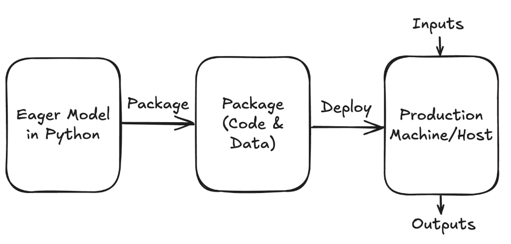
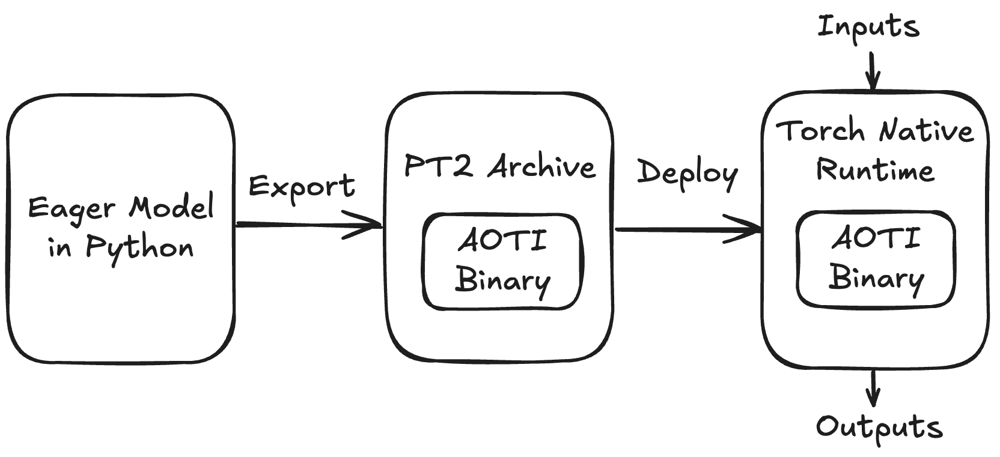
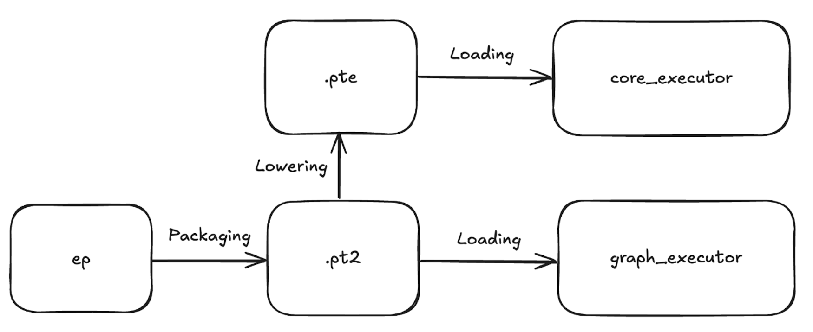

# Torch Native Runtime

**Authors:**
* @zhxchen17
* @SherlockNoMad
* @henryoier

## **Summary**
Torch Native Runtime is a new C++ based runtime designed for executing computation graph captured by torch.export
in non-Pyhton deployment environments. It intends to serve as the standard C++ runtime succeeding TorchScript in
PyTorch 2 with the focus on close integration with libtorch, torch.export, and torch.fx based IR.

The main design goal of Torch Native Runtime is to achieve good portability among different platforms over the common
devices PyTorch supports today (e.g. CPU, CUDA) and provide some level of hardware heterogeneity to run model
on different devices if needed. We intend to expose Torch Native Runtime as a component of libtorch to be integrated
with other inference product (e.g. ExecuTorch, TorchNative) and this RFC describes our plan and open questions regarding
open sourcing the Torch Native Runtime (abbreviated as "nativert" later on).

## **Motivation**
With PyTorch being the most popular framework in the research community, lots of people are trying to bring models authored in PyTorch to production environments. During the PyTorch 1.0 era, our response to Inference was TorchScript, which we pivoted away due to fundamental flaws in its frontend design. However, its ability to capture full graphs, store it in a single hermetic file with a reasonable level of portability guarantee, remains extremely appealing to our users. With our pivot, we risk leaving a critical gap for deployment users, where competing frameworks/tools could potentially fill and create more fragmentation over PyTorch's ecosystem. Luckily, with the progress of PT2 we now have an even better offering than TorchScript. We should take advantage of it and strive to fill the gap by revolutionizing the frontend, but still  provide a similar user experience in packaging and runtime, enhanced with a set of modern features from PT2.

Roughly speaking, for inference we need at least 2 steps to productionize something:
1. Package the eager model into a stable format (code + data checkpoints).
2. Fetch the packages into the production machines, which may have different sw/hw/configurations and run them.



One potential approach among the OSS community to achieve required portability is packaging all the Python code in a wheel and containerizing them in Docker for production serving. This “Pure Python Inference” workflow, however, typically is not adopted in many professional setups due to the imposed costs on:
- Security & Reliability: Using Python in production is strictly prohibited by some user groups/companies because of fundamental design choices in Python, like dynamic typing and lack of compile time memory safety checks..
- Performance: Lack of multithreading support and Python overheads.
- Packaging and BC Surface: Packaging and managing Python dependencies, C extensions, etc becomes costly and error-prone as scale grows.

Given these constraints, we need to develop a solution to break free from the Python environment if we want to be a solution serving most use cases.
- On the frontend side (graph capturing + packaging), we’re converging to a unified solution: torch.export, which converts an eager model into a serializable torch.fx graph.
- On the backend side (deployment), we want to have a well-discussed strategy and informed decision about our Inference story to be ready for PT2 in 2025.

Based on our past interactions with the target users, **their core demands for PyTorch inference are**:
* Easy model packaging solution
* Strong portability and correctness guarantee
* Performance-focused compilation should be optional per users’ choice rather than a mandate

## **Key Offerings**

For end users:

*  “What You See Is What You Get”: We offer a standard way to deploy PyTorch models with only libtorch. It is guaranteed to work as long as the original eager model is exported, and users will always use libtorch across development and deployment.
* “Export once, run on GPU and CPU”: We offer portability over a range of devices just like PyTorch eager, there’s no need to decide the targeting device during development time. (Even Windows should work!)

For 3rd party developers:

* We offer an official way to integrate their accelerators and runtime with the PyTorch ecosystem under C++ environments.
    * For example, we are working with the TensorRT team to decide the integration point of full graph export, and we would recommend nativert as the way forward, and so far they prefer a runtime-based solution.

For nativert, we will be in a fairly competitive space but we are able to offer enough unique features for people to differentiate from others:

* An interpreter that can run ALL exported programs based on libtorch.
* Native support for both CPU and GPU. First class AOTInductor support to achieve state-of-art performance.
* Built-in extension points for custom hardware/accelerator integration.
* Backward/forward compatibility support for online model deployment.
* Easy resource management on model weights and multiple threads.
* Control flow operator support.

## **Proposed Implementation**

We propose nativert to be used like the following:



This echo the previous deployment diagram in the "Motivation" section. There are a few key components for this proposal:
1. An optional AOTI component which optionally accelerates graph execution by compiling models to binaries.
2. A stable file format "PT2 Archive" which is based on zip file format and contains exported graph
and AOTI compiled arfifacts optionally.
3. The Torch Native Runtime which takes PT2 Archive and execute the model with inputs and outputs.

To put it under more specific API showcase:

Frontend
```Python
ep = torch.export.export(model, args, kwargs)

from torch.export.package import package_model
from torch.export.package.pt2_archive import PT2ArchiveWriter

with open(FILENAME) as f:
    with PT2ArchiveWriter(f) as archive_writer:
        package_model(
            ep,
            MODEL_NAME,
            archive_writer,
        )
```

Backend
```C++
#include <torch/nativert/ModelRunner.h>

using torch::nativert::BaseRuntimeConfig;
using torch::nativert::ExecutorType;
using torch::nativert::Placement;
using torch::nativert::ModelRunner;

int main() {
  ExecutorType executor_type = ExecutorType::INTERPRETER;
  BaseRuntimeConfig runtime_config; // can be set to default value most of the time.
  Placement placement;  // can be set to default value most of the time.
  ModelRunner model_runner(FILENAME, MODEL_NAME, executor_type, runtime_config, placement);

  // args and kwargs should have the same PyTree spec as the example inputs from Python
  std::vector<c10::IValue> args = ...;
  std::unordered_map<std::string, c10::IValue> kwargs = ...;

  c10::IValue result = model_runner.run(args, kwargs); // safe to be called from multiple threads

  return 0;
}
```

Therefore here is the list of types we expose as TORCH_API:
- ModelRunner (and its base class ModelRunnerBase) (from torch/nativert/ModelRunner.h)
  - The main execution engine and entry point for exported graph.
- BaseRuntimeConfig (from torch/nativert/executor/ModelRunnerBase.h)
  - Centralized type to store configs/knobs.
- ExecutorType (from torch/nativert/executor/ModelRunnerBase.h)
  - The delegate executor type to be used for execution. Currently supports: 1. Plain interpreter (default) 2. AOTInductor 3. MTIA delagate.
- Placement (from torch/nativert/executor/Placement.h)
  - Typically not used. Sometimes useful for adjusting the device of weights during model loading.

### Code layout

There are mainly two parts of sigmoid: C++ part and Python part.
- Currently we put all the C++ code under `torch/nativert`. All the function/classes are put under c++ namespace `torch::nativert`
- Python code are put under `torch/export/`. Python code is needed for packaging torch.export() artifacts into *PT2 Archive* and later loaded by the C++ runtime.

## **Metrics**
We think it will be a good start to accomplish the following in 2025:
1. Feature parity: nativert can work on a set of jit-tracable models. (H1)
2. OSS Coverage: We can run nativert on a list of OSS models. (H1)
   a. Criteria: Anything working on HuggingFace Optimum should be a good candidate.
3. Community: We have 1 oss customer adopting nativert in their e2e workflow. (H2)

## **FAQ**

### “Are we targeting Desktop/PC use cases here?”

* We will target "commodity hardware", meaning the architecture is vendored by >= 2 vendors. Example: x64, CUDA/ROCM.
* We intend to target common PC environments via ExecuTorch being the frontend API surface.

### “What is your overall strategy for deprecating TorchScript in OSS?”

We plan to:

* Make a clear announcement to oss users that TorchScript is deprecated, in favor of nativert. But we will not force deprecate Torchscript but focus on providing a better solution.
* Leverage major partners, ONNX, TRT, Executorch, HF, who are actively moving users away from Torchscript with their respective unique competitive advantage as incentive for users to migrate.

### “Does your deprecation strategy mean that we will pretty much never be able to delete TorchScript?”

* Possibly. But it is more likely that once nativert is prominent enough, we could delete it. Those users who stay with TorchScript will need to stay with an older PyTorch version.

### “Any performance regression from TorchScript?”

* Single digit percentage (&lt;10%) improvement over TorchScript interpreter from improvements like static dispatch, memory planning, inter-op parallelism and overhead reduction.
* AoTI is the (optional) performance play that users can choose to use with nativert. AoTI is on average 2x the speed of Eager mode.

### "How can we be sure that it will have the features OSS users need and its details are polished with OSS users at heart?”

* We have been very careful about adding features to nativert, anything that stems from Meta-specific requirements will not find its way into nativert.
* We have been minimalist in designing/implementing nativert, its core feature is extremely simple: loading and running model.
* We will use a list of head models from HF to validate our solution.

### TorchScript natively supports Python control flow, what about torch.export?

We will still require users to rewrite their control flow into ops like torch.cond, as a fundamental design choice for torch.export:

* Based on our observations on oss models, we can get away with control flow ops in most cases.
* Fully implementing Python control flow will be challenging work and we don’t want to greatly increase the complexity of the frontend by adding control flow support.
* Users have the incentive to rewrite them in the model code usually due to performance and portability concerns.

## **Alternatives**

The major alternative to C++ based runtime is **Python Inference**, which performs inference in Python based environments. Despite the fact that
PyTorch 2.0 works better under Python based environments and it will be a more popular solution for many users, we think Python Inference has
fundamentally different tradeoffs from C++ based inference stack. For example, Python based inference solution usually has fewer blocker to be
enabled in production so it is suitable for users who optimize for time-to-market, while C++ based inference has advantages like lower overhead
and easier packaging solution, that results in other deployment property desited for different type of setting.

We still think for most PyTorch inference cases in production, we should recommend people to try Python Inference first. If Python is not desired in
their production environment (like we observed in many use cases), we should provide a path for people to utilize libtorch with a runtime in the
production environments, which is what this RFC tries to address.

## **Prior Art**
### TorchScript


TorchScript is the standard solution for deployment during PyTorch 1.0. For PT2 we don’t want to recommend TorchScript because:

* TorchScript has not been actively developed by the team for a few years.
* The design of TorchScript runtime is more complex than PT2 based solutions, which results in more overhead during model execution.

Note that we do want to offer a similar experience like TorchScript given the fact that TS is quite popular in the OSS world. Therefore, the ideal solution should capture the UX characteristics from TorchScript while adopting the new compiler technologies we developed for PT2.


### ONNX


ONNX is another popular solution in the OSS community. Actually, ONNX already depends on either torch.jit.trace or torch.export today and might adopt torch.export fully in future. It runs on many types of devices, even in the browsers. However, we need to be careful to recommend using ONNX because:

* Strategically speaking, PyTorch team doesn’t have control over ONNX’s op set, IR definition or the runtime library. Relying on ONNX will impose significant execution risk. Our goal here is to have more control over the future directions of PT2 inference stack, so we need a more PyTorch-native solution to achieve this goal.
* For users who already have PyTorch models, it’s another step of conversion which will not reduce the friction for users to deploy models.

Suppose we release a component very similar to ONNX in the OSS, then we will have some overlap with ONNX directly, but we think it shouldn’t be a problem, just like TorchScript and ONNX can co-exist.

### ExecuTorch


ExecuTorch is the first oss solution adopting PT2 export for inference workload under constrained environments. It has many appealing features which makes it an appealing option to recommend users to.

Compared to nativert, it already built more awareness in the oss community and our plan is to collaborate with ExecuTorch team and build a shared inference oss story.

### AOTI / Precompile


AOTI will be an important piece of technology we use in PT2 Inference stack. For UX perspective, there might be some major gaps if we want to make it the main solution in 2025:

* Torch Native Runtime should provide some strong portability guarantee to the users, meaning in most cases, users shouldn’t repackage the model multiples if the hardware changes, while AOTI today still requires developers to think about specific hardwares.
* Compilation adds friction, and it optimizes for latency. Not all workloads are latency-sensitive, they care more about time-to-market. AOTI could become a blocker when some users just want to “to run a model, with whatever method”.
* For almost anything beyond LLM, AOTI still depends on libtorch and we don’t have a full story for deploying libtorch only in production.
* Hardware heterogeneity becomes important because inference is a very fragmented market, meaning a good solution should be able to have a good hardware integration story.

Precompile is another new workflow we’re adding to PT2. It should be considered for different use cases other than PT2 Inference’s major use cases:

* Precompile integrate into torch.compile() to help users accelerate regions of code instead of the entire model in a “bottom-up” way.
* For inference workload, precompile requires users to manually provide toplevel wrappers in c++, which is not a friction-free solution for most users.

### vLLM / Llama.cpp

Serving stacks like vLLM are popular but they are application specific frameworks. Our goal is to cover all PyTorch models. And vLLM can rely on pieces from PT2 Inference as underlying inference engine.

Llama.cpp is specific to particular models and not generalizable to use cases beyond pure-text transformers.

## **How we teach this**

Initially, we won't advertise nativert directly to end users. Instead, we will make this part of the ExecuTorch brand. We will have developer doc attached to the codebase for libtorch API integrations but it won't be advertised as a full stack solution/product to begin with.

On the packaging level, we will frame native's format and ET’s  format as **different levels of IRs**.

The Workflow



This workflow is more aligned with the “progressive lowering” design of torch.export IR, similar to the idea that "PyTorch does not need a new standardized operator set**"

Since PyTorch is a generic framework serving everyone. We have evolved into a complex stack where there is not 1 single trick to serve every group of users.

Instead, we should expose more config options to people and make it very clear that we are exposing different levels of IR for different purposes. Let people choose, and we pick a reasonable default.


## **Unresolved questions**

* (To Alban/Nikita) Torch Native Runtime today works on Windows with interpreter mode. Should we aim for AOTI support on Windows?
* (To Alban/Nikita) Torch Native Runtime today works on MacOS CPU with interpreter mode. Should we support MPS interpreter + AOTI on MacOS?
* (With Jacob) ExecuTorch needs to serve as the frontend API, and how does ExecuTorch and nativert integrate together?
